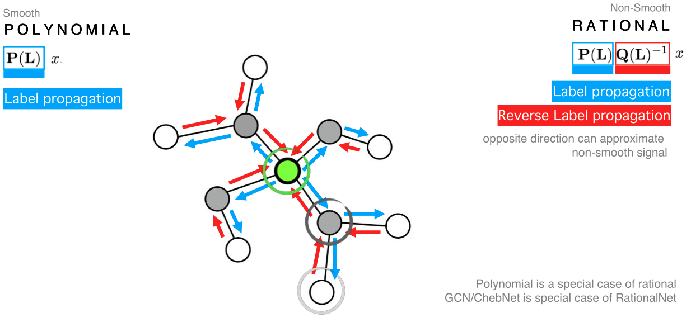
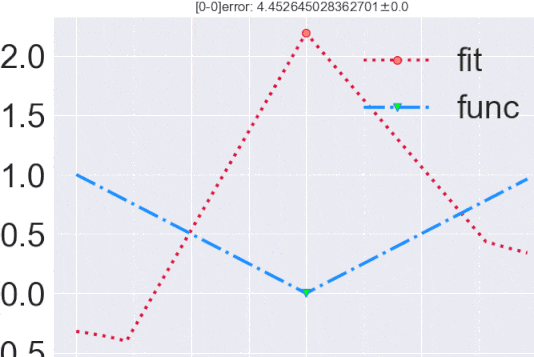

# Rational Neural Networks (RemezNet)


# Demo of Rational Net in spectral domain


# Project Page
[Go to Project Homepage](http://aquastar.github.com/RationalGraphNet)
 
# Rational Neural Network for Graph Signal Prediction

## requirement

## Instruction (under construction)
required python package
```
numpy torch 
```


# Related papar
Codes for the paper 
> Zhiqian Chen, Feng Chen, Rongjie Lai, Xuchao Zhang, and Chang-Tien Lu, Rational Neural Networks for Approximating Jump Discontinuities of Graph Convolution Operator, International Conference on Data Mining(ICDM), Singpore, 2018

# Citation
```
@article{ratgraphnet
  author    = {Zhiqian Chen and
               Feng Chen and
               Rongjie Lai and
               Xuchao Zhang and
               Chang{-}Tien Lu},
  title     = {Rational Neural Networks for Approximating Jump Discontinuities of Graph Convolution Operator},
  booktitle = {Proceedings of the The IEEE International Conference on Data Mining},
  year      = {2018},
}
```
